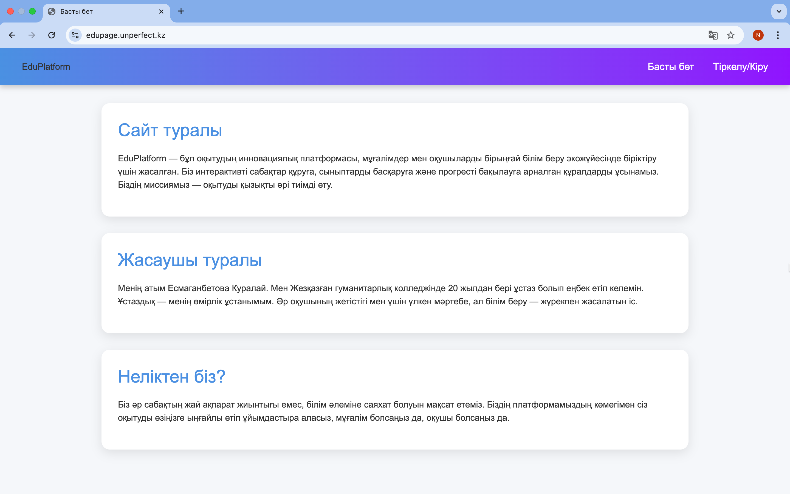
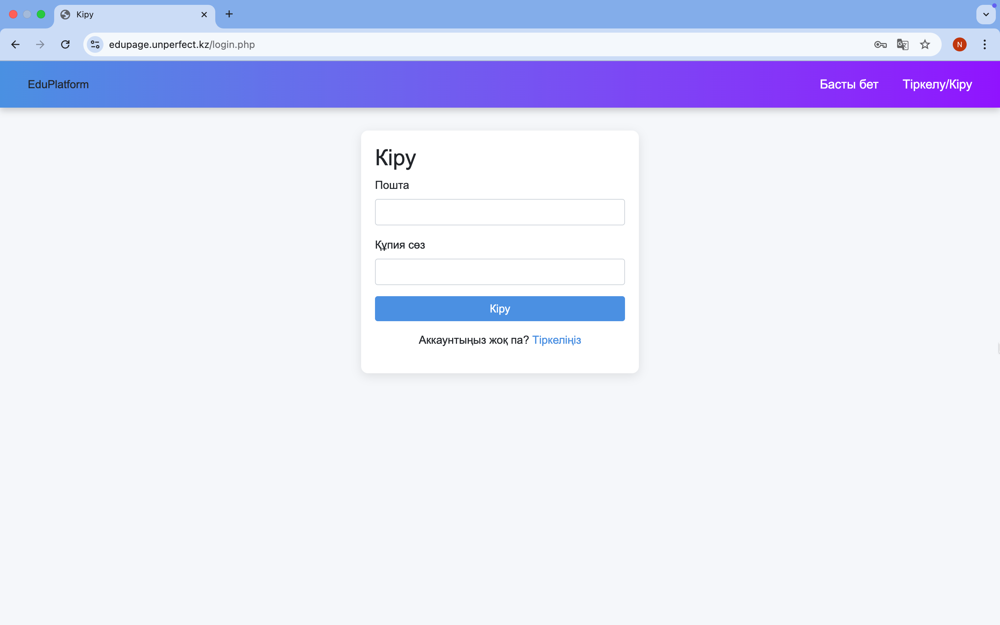
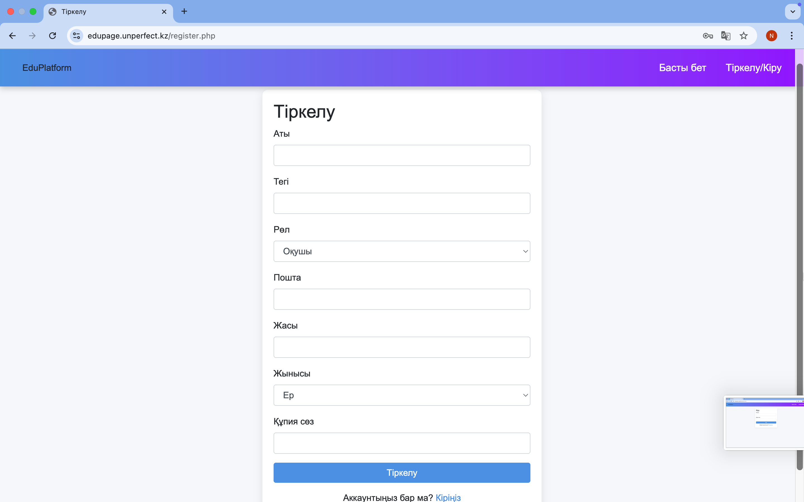
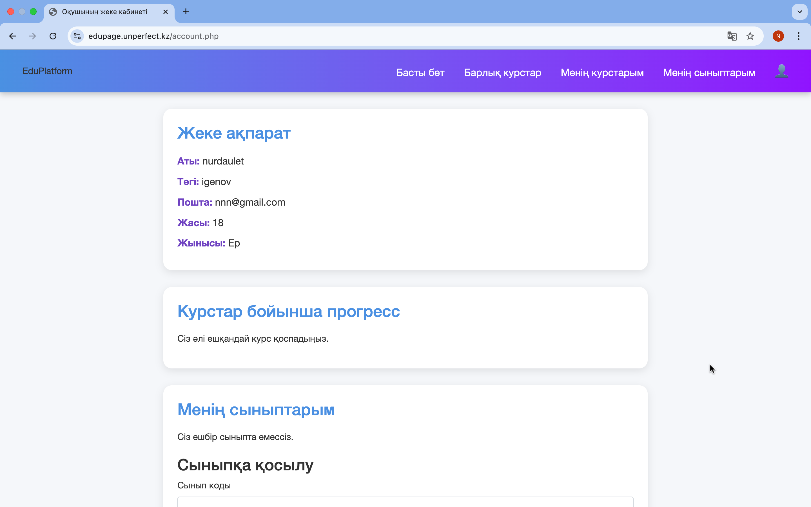
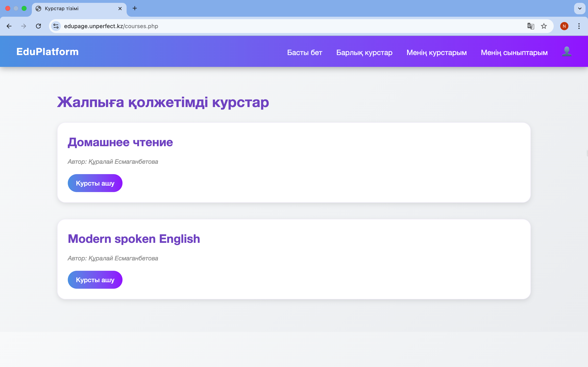
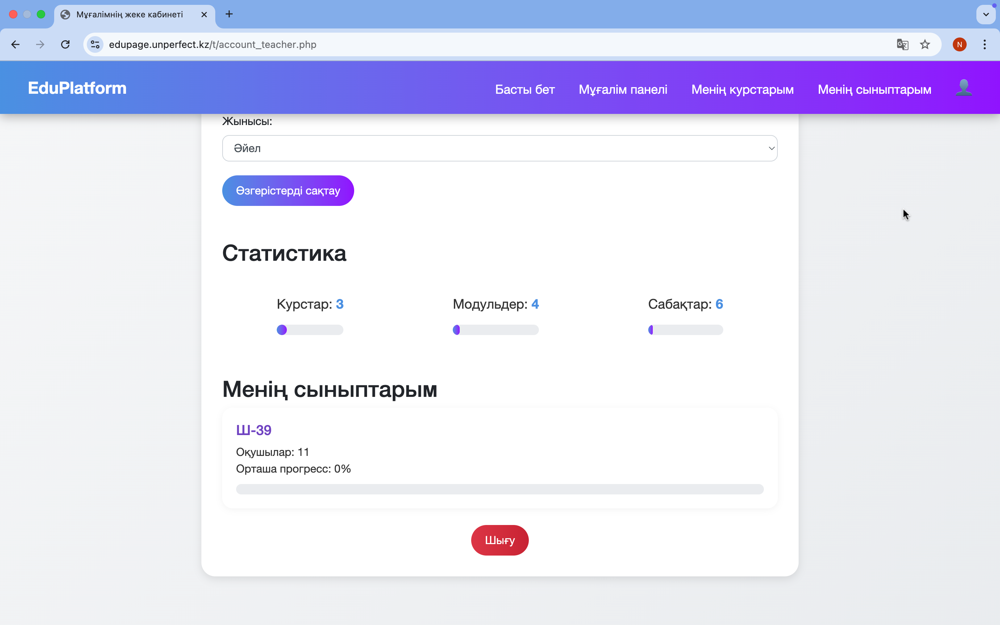
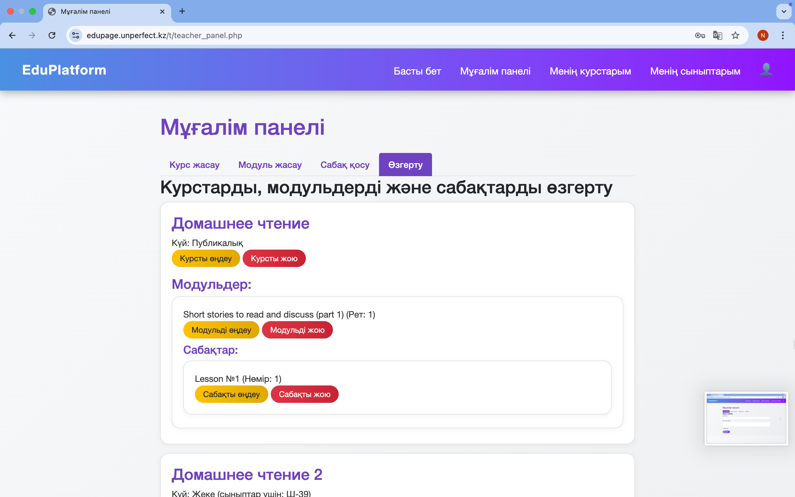
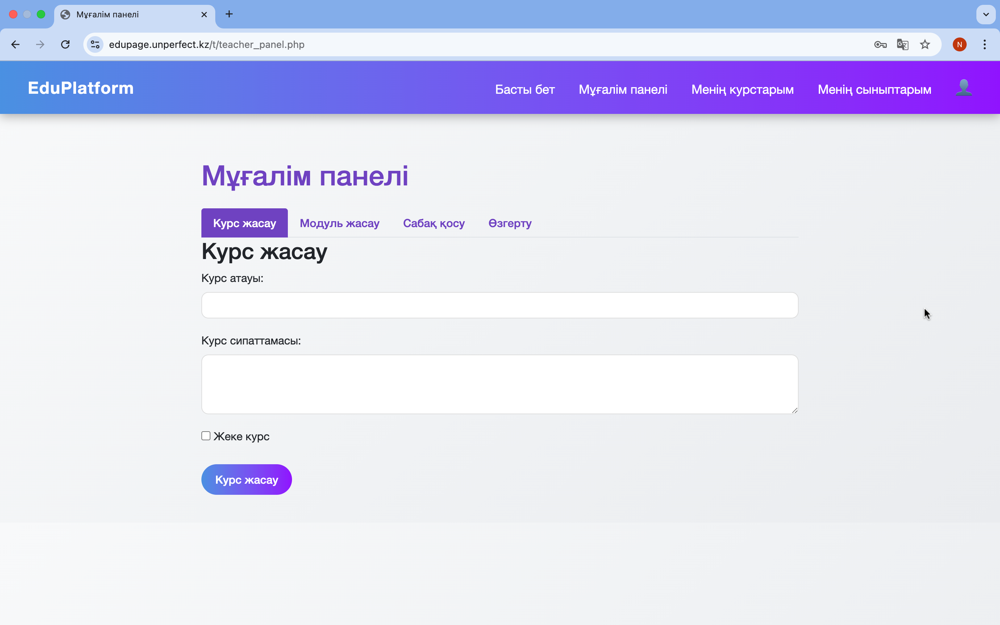
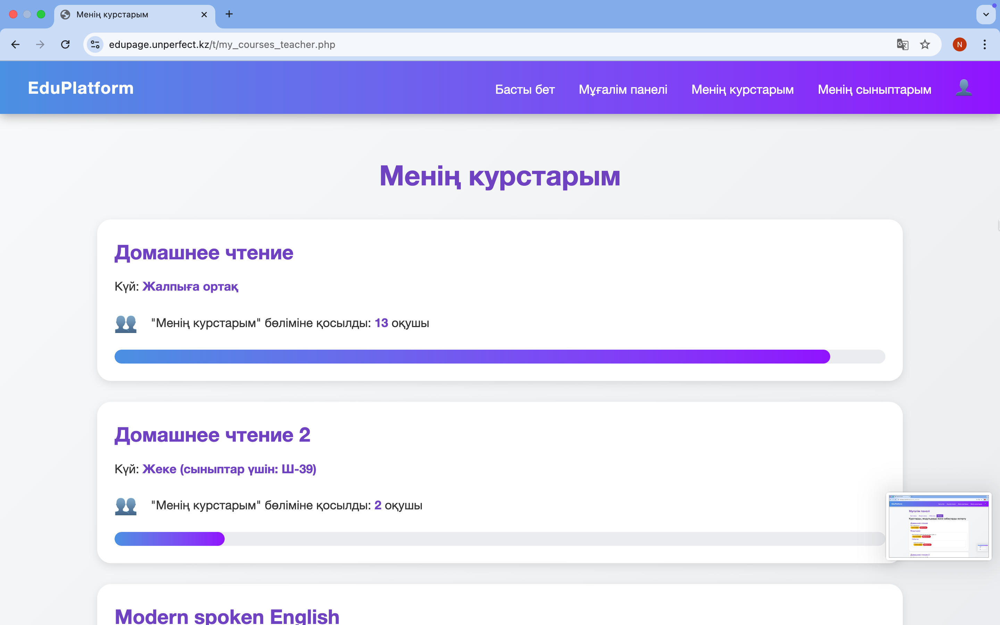

# EduPage – English Language Learning Platform 🇬🇧

**EduPage** is a web-based platform developed in collaboration with Esmaganbetova Kuralai, a teacher at Zhezkazgan Humanities College. The platform offers an intuitive and user-friendly interface for learning English through structured online courses. Teachers can create and manage educational content, while students can explore public courses and track their progress.

---

## 🚀 Features

- 🔓 Access to public English language courses for all users
- 👨‍🏫 Dedicated teacher panel to create and manage courses, modules, and lessons
- ✏️ Easy editing of course details and content
- 📊 Course statistics: number of students who saved a course, interacted with lessons, etc.
- 👥 Simple registration and login system
- 📚 Teachers can add any course to their teaching list

---

## 🖼️ Screenshots & Descriptions

### 🔹 `main.png` – Main Page  
Displays an overview of the platform, links to available courses, login, and registration options.  

---

### 🔹 `login.png` – Login Page  
Allows existing users (students or teachers) to sign in.  

---

### 🔹 `register.png` – Registration Page  
New users can create an account by filling in basic information.  

---

### 🔹 `account.png` – User Account Page  
Shows personal details and options for the logged-in user.  

---

### 🔹 `allc.png` – All Courses Page  
Displays all public English courses available on the platform.  

---

### 🔹 `tac.png` – Teacher Account Settings  
Allows teachers to edit their personal information and teaching profile.  

---

### 🔹 `change.png` – Edit Course Panel  
Teachers can modify existing courses, update titles, modules, and lessons.  

---

### 🔹 `create.png` – Course Creation Panel  
Interface for teachers to create new courses, add modules, and lessons.  

---

### 🔹 `cources.png` – My Courses & Statistics  
Shows all courses created by the teacher and includes statistics such as number of students enrolled or who saved the course.  

---

### 🔹 `join course.png` – Add Course to Teacher’s List  
Teachers can browse public courses and add them to their own teaching panel.  

---

## 🛠️ Technologies Used

- HTML / CSS / JavaScript  
- php
- Clean and beginner-friendly file structure

---

## 👥 Developed by

Created in collaboration with **Esmaganbetova Kuralai**, teacher at Zhezkazgan Humanities College.
